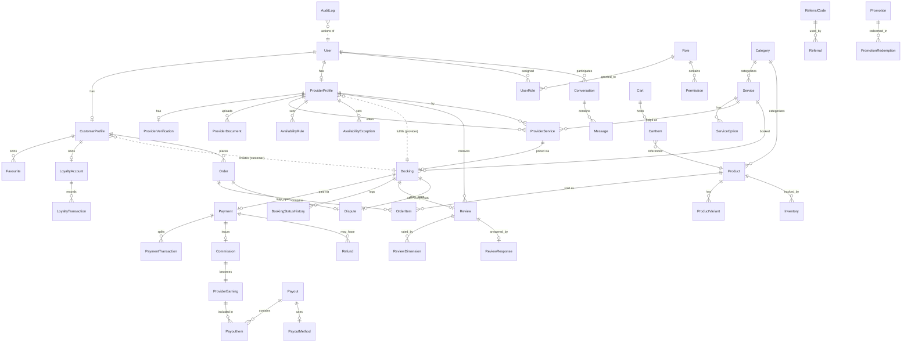

# DATABASE.md — SERVANA Data Model

> Phase 0 blueprint. Schema is expressed in Prisma-flavored notation for
> clarity; the canonical schema lives in `prisma/schema.prisma` (Phase 1).

---

## 1. Conventions

* **PK:** `UUIDv7` (sortable, distributed-safe) unless noted.
* **Money:** `BigInt` minor units (e.g. KES cents). Never `Float`/`Decimal`
  for computation; `Decimal` only for display-safe storage if required by the
  provider, but all arithmetic in `BigInt` cents.
* **Time:** `DateTime` in UTC; store `timestamptz`.
* **Soft delete:** `deletedAt DateTime?` on customer/provider-facing entities.
* **Currency:** `currency` `String(3)` ISO-4217 on every monetary row.
* **Indexes:** explicit on FK, unique business keys, and query columns.
* **Audit:** `AuditLog` is append-only (no update/delete).

---

## 2. Module → Table Map

| Module | Tables |
|--------|--------|
| auth/users | `User`, `UserRole`, `Role`, `Permission`, `Session`, `RefreshToken` |
| customers | `CustomerProfile`, `Favourite` |
| providers | `ProviderProfile`, `ProviderDocument`, `ProviderVerification` |
| categories | `Category` |
| services | `Service`, `ServiceOption`, `ProviderService` |
| availability | `AvailabilityRule`, `AvailabilityException`, `BookingSlot` |
| bookings | `Booking`, `BookingStatusHistory` |
| payments | `Payment`, `PaymentTransaction`, `Refund` |
| commissions | `CommissionRule`, `Commission` |
| earnings | `ProviderEarning` |
| payouts | `Payout`, `PayoutMethod`, `PayoutItem` |
| products | `Product`, `ProductCategory`, `ProductVariant`, `Inventory` |
| orders | `Cart`, `CartItem`, `Order`, `OrderItem`, `OrderStatusHistory` |
| reviews | `Review`, `ReviewDimension`, `ReviewResponse` |
| ratings | (derived views/materialized — not a base table) |
| loyalty | `LoyaltyAccount`, `LoyaltyTransaction`, `Reward`, `LoyaltyTier` |
| referrals | `Referral`, `ReferralCode` |
| promotions | `Promotion`, `PromotionRedemption` |
| notifications | `Notification`, `NotificationTemplate` |
| messaging | `Conversation`, `Message` |
| disputes | `Dispute`, `DisputeMessage` |
| fraud | `FraudAlert`, `FraudRuleRun` |
| analytics/events | `AnalyticsEvent`, `SearchEvent`, `RecommendationEvent` |
| audit | `AuditLog` |
| attribution | `Attribution` (UTM/referral capture) |

### 2.1 Tables merged/separated — rationale

* **`ReviewDimension`** (quality/professionalism/communication/punctuality/value)
  is a child of `Review` rather than 5 nullable columns → extensible, queryable.
* **`BookingStatusHistory`** is separate from `Booking` → immutable audit of
  transitions (required by spec).
* **`Payment` + `PaymentTransaction`:** `Payment` is the intent/aggregate;
  `PaymentTransaction` records each actual movement (capture, refund, fee) so a
  single booking can have multiple transactions. Prevents float/state loss.
* **`ProviderEarning`** is its own immutable ledger (never updated after
  creation except to mark paid via `PayoutItem` link) — distinguishes earning
  accrual from payout.
* **`PayoutItem`** links a `Payout` to many `ProviderEarning`s (many-to-many,
  immutable) → supports batch payouts and reconciliation.
* **Ratings** are **not** a stored base table; they are computed/materialized
  from `Review` + `Booking` to avoid divergence. A `ProviderRankingSnapshot`
  materialized table (in `ratings`) caches the score for performance.
* **`Attribution`** captures UTM/referral at session/booking/order time →
  supports social-media ROI without polluting core entities.

---

## 3. Entity Definitions (core)

```prisma
model User {
  id            String   @id @default(uuid())
  email         String   @unique
  phone         String?  @unique
  passwordHash  String
  status        UserStatus @default(ACTIVE)
  roles         UserRole[]
  customerProfile CustomerProfile?
  providerProfile ProviderProfile?
  createdAt     DateTime @default(now())
  updatedAt     DateTime @updatedAt
  deletedAt     DateTime?
}

enum UserStatus { ACTIVE SUSPENDED DEACTIVATED }

model Role {
  id          String @id @default(uuid())
  name        String @unique // USER, CUSTOMER, PROVIDER, SUPPORT, ADMIN, SUPER_ADMIN
  permissions Permission[]
  users       UserRole[]
}

model Permission {
  id    String @id @default(uuid())
  key   String @unique // e.g. "booking:refund"
  roles Role[]
}

model UserRole {
  userId String
  roleId String
  user   User   @relation(fields: [userId], references: [id])
  role   Role   @relation(fields: [roleId], references: [id])
  @@id([userId, roleId])
}

model CustomerProfile {
  id     String @id @default(uuid())
  userId String @unique
  user   User   @relation(fields: [userId], references: [id])
  favourites Favourite[]
  createdAt DateTime @default(now())
}

model ProviderProfile {
  id            String   @id @default(uuid())
  userId        String   @unique
  user          User     @relation(fields: [userId], references: [id])
  businessName  String?
  slug          String   @unique
  bio           String?
  // location / service radius
  lat           Float?
  lng           Float?
  serviceRadiusKm Float?
  travelToCustomer Boolean @default(false)
  status        ProviderStatus @default(DRAFT)
  verification  ProviderVerification?
  documents     ProviderDocument[]
  services      ProviderService[]
  createdAt     DateTime @default(now())
  updatedAt     DateTime @updatedAt
}

enum ProviderStatus { DRAFT PENDING_VERIFICATION VERIFIED SUSPENDED }

model ProviderVerification {
  id          String @id @default(uuid())
  providerId  String @unique
  provider    ProviderProfile @relation(fields: [providerId], references: [id])
  level       VerificationLevel @default(BASIC)
  expiresAt   DateTime?
  verifiedById String?
  verifiedAt  DateTime?
}

enum VerificationLevel {
  BASIC PHONE_VERIFIED IDENTITY_VERIFIED PROFESSIONAL_VERIFIED
  BUSINESS_VERIFIED TRUSTED_PROVIDER
}

model ProviderDocument {
  id          String @id @default(uuid())
  providerId  String
  provider    ProviderProfile @relation(fields: [providerId], references: [id])
  kind        String // ID, CERT, BUSINESS_REG
  storageKey  String // S3 key (private bucket)
  uploadedAt  DateTime @default(now())
  @@index([providerId])
}
```

---

## 4. Services & Availability

```prisma
model Category {
  id          String @id @default(uuid())
  slug        String @unique
  name        String
  parentId    String? // self-relation for taxonomy
  services    Service[]
}

model Service {
  id          String @id @default(uuid())
  categoryId  String
  category    Category @relation(fields: [categoryId], references: [id])
  name        String
  description String?
  basePriceCents BigInt
  currency    String @default("KES")
  durationMin Int
  deliveryTypes ServiceDeliveryType[]
  options     ServiceOption[]
  providerServices ProviderService[]
}

enum ServiceDeliveryType { AT_PROVIDER_LOCATION AT_CUSTOMER_LOCATION REMOTE EITHER }

model ServiceOption {
  id        String @id @default(uuid())
  serviceId String
  service   Service @relation(fields: [serviceId], references: [id])
  label     String
  priceDeltaCents BigInt @default(0)
}

model ProviderService {
  id          String @id @default(uuid())
  providerId  String
  serviceId   String
  priceCents  BigInt // provider-specific override
  currency    String @default("KES")
  isActive    Boolean @default(true)
  @@unique([providerId, serviceId])
  @@index([providerId])
}

model AvailabilityRule {
  id         String @id @default(uuid())
  providerId String
  dayOfWeek  Int // 0-6
  startMin   Int // minutes from midnight
  endMin     Int
  breakStart Int?
  breakEnd   Int?
  @@index([providerId])
}

model AvailabilityException {
  id         String @id @default(uuid())
  providerId String
  date       DateTime
  type       ExceptionType // TIME_OFF, EXTRA, HOLIDAY
  @@index([providerId, date])
}

enum ExceptionType { TIME_OFF EXTRA HOLIDAY }
```

---

## 5. Booking (state machine + history)

```prisma
model Booking {
  id            String @id @default(uuid())
  customerId    String
  providerId    String
  serviceId     String
  providerServiceId String
  status        BookingStatus @default(PENDING)
  startsAt      DateTime
  endsAt        DateTime
  // location snapshot
  deliveryType  ServiceDeliveryType
  address       Json?
  priceCents    BigInt // frozen at creation
  currency      String @default("KES")
  paymentStatus PaymentStatus @default(INITIATED)
  cancellationReason String?
  createdAt     DateTime @default(now())
  history       BookingStatusHistory[]
  payment       Payment?
  review        Review?
}

enum BookingStatus {
  PENDING AWAITING_PAYMENT PAID CONFIRMED PROVIDER_ACCEPTED
  PROVIDER_REJECTED IN_PROGRESS COMPLETED CANCELLED
  NO_SHOW DISPUTED REFUNDED EXPIRED
}

enum PaymentStatus {
  INITIATED PENDING SUCCESSFUL FAILED CANCELLED REFUNDED PARTIALLY_REFUNDED
}

model BookingStatusHistory {
  id        String @id @default(uuid())
  bookingId String
  booking   Booking @relation(fields: [bookingId], references: [id])
  from      BookingStatus?
  to        BookingStatus
  actorId   String?
  reason    String?
  createdAt DateTime @default(now())
  @@index([bookingId])
}
```

---

## 6. Financial Ledger (immutable)

```prisma
model Payment {
  id              String @id @default(uuid())
  bookingId       String? @unique
  orderId         String? @unique
  customerId      String
  providerId      String?
  amountCents     BigInt
  currency        String @default("KES")
  status          PaymentStatus
  provider        String // PaymentProvider adapter id, e.g. "mpesa"
  providerRef     String? // PSP transaction id
  idempotencyKey  String @unique
  grossCents      BigInt
  discountCents   BigInt @default(0)
  taxCents        BigInt @default(0)
  feeCents        BigInt @default(0)
  commissionCents BigInt @default(0)
  netCents        BigInt
  createdAt       DateTime @default(now())
  transactions    PaymentTransaction[]
  refunds         Refund[]
}

model PaymentTransaction {
  id          String @id @default(uuid())
  paymentId   String
  payment     Payment @relation(fields: [paymentId], references: [id])
  type        TxnType // CAPTURE, FEE, REFUND, PAYOUT
  amountCents BigInt
  currency    String
  createdAt   DateTime @default(now())
}

enum TxnType { CAPTURE FEE REFUND PAYOUT ADJUSTMENT }

model Refund {
  id          String @id @default(uuid())
  paymentId   String
  amountCents BigInt
  reason      String?
  createdAt   DateTime @default(now())
}

model CommissionRule {
  id          String @id @default(uuid())
  scope       String // "standard" | "category:hair" | "provider:<id>" | "tier:premium"
  type        CommissionType // PERCENTAGE | FIXED
  value       BigInt // percent in basis points or fixed cents
  priority    Int
  validFrom   DateTime
  validTo     DateTime?
}

enum CommissionType { PERCENTAGE FIXED }

model Commission {
  id            String @id @default(uuid())
  paymentId     String @unique
  ruleSnapshot  Json // frozen rule + computed basis
  baseCents     BigInt
  rateBasisPoints Int
  commissionCents BigInt
  createdAt     DateTime @default(now())
}

model ProviderEarning {
  id            String @id @default(uuid())
  providerId    String
  bookingId     String? @unique
  orderId       String? @unique
  grossCents    BigInt
  commissionCents BigInt
  feeCents      BigInt
  refundCents   BigInt @default(0)
  adjustmentCents BigInt @default(0)
  netCents      BigInt // immutable accrual
  status        EarningStatus @default(PENDING)
  createdAt     DateTime @default(now())
  payoutItems   PayoutItem[]
}

enum EarningStatus { PENDING AVAILABLE PAID REVERSED }

model PayoutMethod {
  id         String @id @default(uuid())
  providerId String
  type       PayoutMethodType // MPESA, BANK
  detailsRef String // encrypted/token reference, never raw secrets
  isDefault  Boolean @default(false)
}

enum PayoutMethodType { MPESA BANK }

model Payout {
  id          String @id @default(uuid())
  providerId  String
  methodId    String
  status      PayoutStatus @default(PENDING)
  totalCents  BigInt
  currency    String @default("KES")
  reference   String @unique
  createdAt   DateTime @default(now())
  items       PayoutItem[]
}

enum PayoutStatus { PENDING PROCESSING SUCCESSFUL FAILED REVERSED }

model PayoutItem {
  id        String @id @default(uuid())
  payoutId  String
  earningId String
  amountCents BigInt
  @@unique([payoutId, earningId])
}
```

### 6.1 Why this is immutable

`Payment`, `PaymentTransaction`, `Commission`, `ProviderEarning` rows are
**never updated** after creation (except controlled status transitions recorded
in their own fields, not value edits). Historical commission % is frozen in
`Commission.ruleSnapshot` + `rateBasisPoints`. Changing `CommissionRule` today
cannot alter past `Commission` rows — reports always read the snapshot.

---

## 7. Products & Orders

```prisma
model Product {
  id          String @id @default(uuid())
  categoryId  String?
  name        String
  brand       String?
  sku         String @unique
  priceCents  BigInt
  saleCents   BigInt?
  currency    String @default("KES")
  status      ProductStatus @default(ACTIVE)
  providerId  String? // provider mini-store
  variants    ProductVariant[]
  inventory   Inventory[]
}

enum ProductStatus { ACTIVE INACTIVE ARCHIVED }

model ProductVariant {
  id         String @id @default(uuid())
  productId  String
  attrs      Json // size/color
  priceDeltaCents BigInt @default(0)
}

model Inventory {
  id         String @id @default(uuid())
  productId  String
  variantId  String?
  quantity   Int
  reserved   Int @default(0)
  @@unique([productId, variantId])
}

model Cart {
  id        String @id @default(uuid())
  customerId String @unique
  items     CartItem[]
}

model CartItem {
  id         String @id @default(uuid())
  cartId     String
  productId  String
  variantId  String?
  qty        Int
  @@unique([cartId, productId, variantId])
}

model Order {
  id          String @id @default(uuid())
  customerId  String
  status      OrderStatus @default(CREATED)
  subtotalCents BigInt
  discountCents BigInt @default(0)
  totalCents BigInt
  currency    String @default("KES")
  items       OrderItem[]
  history     OrderStatusHistory[]
}

enum OrderStatus { CREATED PAID FULFILLMENT SHIPPED DELIVERED COMPLETED CANCELLED REFUNDED }

model OrderItem {
  id         String @id @default(uuid())
  orderId    String
  productId  String
  variantId  String?
  qty        Int
  unitCents  BigInt // frozen price
}

model OrderStatusHistory {
  id        String @id @default(uuid())
  orderId   String
  from      OrderStatus?
  to        OrderStatus
  createdAt DateTime @default(now())
}
```

---

## 8. Loyalty / Referrals / Promotions

```prisma
model LoyaltyAccount {
  id          String @id @default(uuid())
  customerId  String @unique
  tierId      String
  balanceCents BigInt @default(0) // DENORMALIZED cache only; source of truth = transactions
  createdAt   DateTime @default(now())
  transactions LoyaltyTransaction[]
}

model LoyaltyTransaction {
  id          String @id @default(uuid())
  accountId   String
  type        LoyaltyTxnType // EARN_REVIEW, EARN_BOOKING, EARN_REFERRAL, EARN_PURCHASE, BONUS, REDEEM
  deltaCents  BigInt // + or -
  reason      String
  refType     String? // booking|order|review|referral
  refId       String?
  createdAt   DateTime @default(now())
  @@index([accountId])
}

enum LoyaltyTxnType { EARN_BOOKING EARN_REVIEW EARN_REFERRAL EARN_PURCHASE BONUS REDEEM }

model Reward { id String @id @default(uuid()) name String costCents BigInt }
model LoyaltyTier { id String @id @default(uuid()) name String thresholdCents BigInt }

model ReferralCode {
  id        String @id @default(uuid())
  customerId String
  code      String @unique
}

model Referral {
  id          String @id @default(uuid())
  codeId      String
  referredId  String
  campaignId  String?
  firstBookingId String?
  rewardStatus RewardStatus @default(PENDING)
}

enum RewardStatus { PENDING QUALIFIED PAID }

model Promotion {
  id        String @id @default(uuid())
  code      String @unique
  kind      PromotionKind // PERCENTAGE, FIXED, FREE_SHIP
  value     BigInt
  validFrom DateTime
  validTo   DateTime?
}

enum PromotionKind { PERCENTAGE FIXED FREE_SHIP }

model PromotionRedemption {
  id    String @id @default(uuid())
  promoId String
  bookingId String?
  orderId   String?
}
```

> **Loyalty rule:** `balanceCents` is a *cache*; the authoritative value is the
> sum of `LoyaltyTransaction.deltaCents`. Any display/redemption recomputes from
> the ledger (or a verified cached rollup job) — never a single mutable counter.

---

## 9. Reviews, Ratings, Disputes, Fraud, Events

```prisma
model Review {
  id           String @id @default(uuid())
  bookingId    String @unique // only after completed booking
  orderId      String? @unique
  customerId   String
  providerId   String
  overall      Int // 1-5
  title        String?
  body         String?
  dimensions   ReviewDimension[]
  response     ReviewResponse?
  reported     Boolean @default(false)
  createdAt    DateTime @default(now())
}

model ReviewDimension {
  id       String @id @default(uuid())
  reviewId String
  name     String // quality|professionalism|communication|punctuality|value
  score    Int    // 1-5
}

model ReviewResponse {
  id       String @id @default(uuid())
  reviewId String @unique
  body     String
  createdAt DateTime @default(now())
}

model Dispute {
  id         String @id @default(uuid())
  bookingId  String?
  orderId    String?
  openedById String
  status     DisputeStatus @default(OPEN)
  resolution DisputeResolution?
}

enum DisputeStatus { OPEN REVIEW RESOLVED REJECTED }
enum DisputeResolution { REFUND PARTIAL_REFUND REJECTED ADJUST_PAYOUT }

model FraudAlert {
  id        String @id @default(uuid())
  entityType String // user|booking|review|payout
  entityId   String
  score      Int
  reason     String
  status     FraudStatus @default(OPEN)
}

enum FraudStatus { OPEN REVIEWED FALSE_POSITIVE ACTIONED }

model AnalyticsEvent {
  id        String @id @default(uuid())
  type      String
  payload   Json
  userId    String?
  createdAt DateTime @default(now())
  @@index([type, createdAt])
}

model SearchEvent {
  id        String @id @default(uuid())
  query     String
  filters   Json
  userId    String?
  createdAt DateTime @default(now())
}

model RecommendationEvent {
  id        String @id @default(uuid())
  userId    String
  itemType  String // provider|service|product
  itemId    String
  source    String // rule|ml
  createdAt DateTime @default(now())
}

model AuditLog {
  id        String @id @default(uuid())
  actorId   String?
  action    String
  entity    String
  entityId  String
  before    Json?
  after     Json?
  ip        String?
  createdAt DateTime @default(now())
  @@index([entity, entityId])
}
```

---

## 10. ERD (Mermaid)



### 10.1 Cardinality highlights

* `User → CustomerProfile` (0..1) and `User → ProviderProfile` (0..1): a user
  may have neither (unfinished onboarding), one, or both.
* `Provider → ProviderService ← Service`: join entity lets each provider set
  their own price/duration while reusing the catalog `Service`.
* `Customer → Booking` and `Provider → Booking`: booking references **both**
  parties.
* `Booking → Payment` (1:1) → `Commission` (1:1) → `ProviderEarning` (1:1) →
  `PayoutItem` (many:many to `Payout`): clean money flow with snapshots.
* `Customer → LoyaltyAccount → LoyaltyTransaction`: ledger-only balance.

---

## 11. AI / Analytics Data Foundation

`AnalyticsEvent`, `SearchEvent`, `RecommendationEvent` are append-only and feed
the future recommendation/ranking/AI layers. They contain only necessary,
non-PII-enriched signals (IDs + typed payloads), satisfying data-minimization
(see `SECURITY.md` and `AI.md`).

---

## 12. Indexing & Performance Notes

* Unique: `User.email`, `ProviderProfile.slug`, `Payment.idempotencyKey`,
  `Product.sku`, `ReferralCode.code`, `Promotion.code`, `Payout.reference`.
* FK indexes on all `*Id` columns used in filters/joins.
* Composite: `AvailabilityException(providerId, date)`,
  `Booking(providerId, startsAt)`, `Booking(customerId, status)`.
* Consider partial index `Booking(status)` for active-booking lookups.
* Materialize `ProviderRankingSnapshot` to avoid live aggregation on listing.
